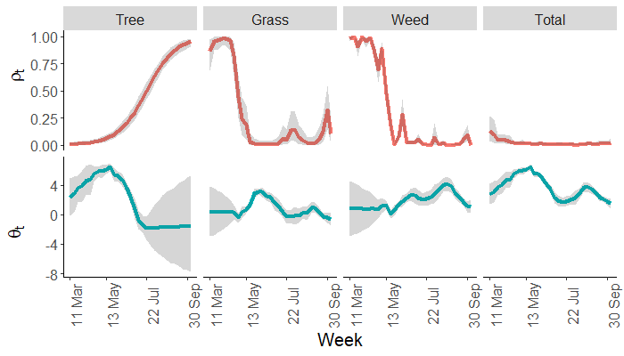
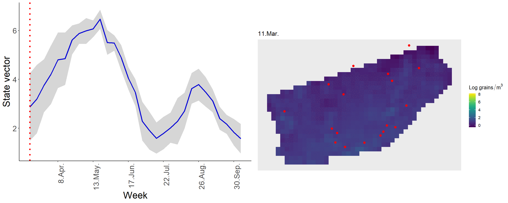
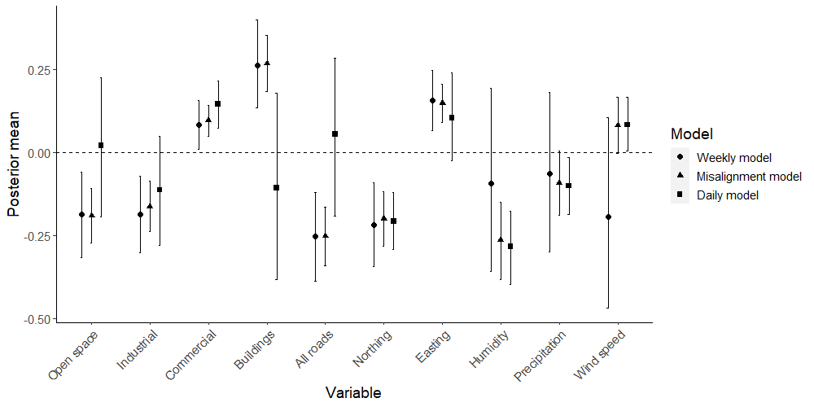
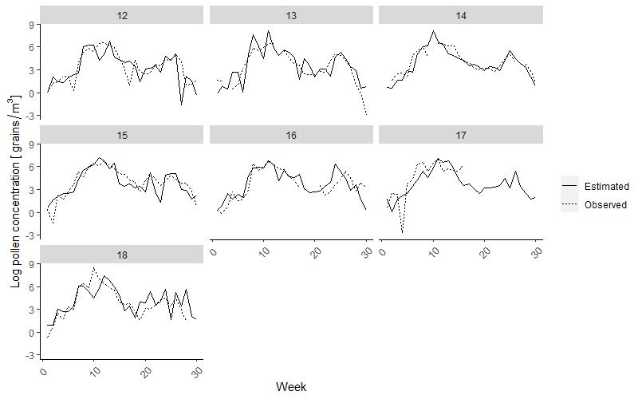

```{r setup, include=FALSE}
options(htmltools.dir.version = FALSE)
knitr::opts_chunk$set(collapse = TRUE,
                      fig.retina = 3)
library(xaringanExtra)
library(tidyverse)
library(gganimate)
library(leaflet)
library(sp)
library(raster)
library(tidyverse)
library(viridis)

rasters_path <- "rasters"

```

```{r xaringan-panelset, echo=FALSE}
xaringanExtra::use_panelset()
 # xaringanExtra::use_progress_bar(color = "#a6b155", location = "bottom")
```


class: nasa-slide, center, middle, inverse

# `r rmarkdown::metadata$title`

### `r rmarkdown::metadata$author` 

### `r rmarkdown::metadata$date`

.footnote[Photo by [NASA Johnson](https://www.flickr.com/photos/nasa2explore/51000025291/in/photostream/)]


---

class: title-slide, left, middle, inverse

background-image: url("img/lemontrealer.jpg")
background-position: right
background-size: contain


.pull-left[

# Outline

- Introduction

- Spatial modelling of ambient concentrations of VOCs in Montreal, Canada (Manuscript 1)

- Spatio-temporal modelling of pollen concentration in Toronto, Canada (Manuscripts 2 and 3)

- General conclusions

.footnote[Art by [Diane Obomsawin](https://lemontrealer.com/diane-obomsawin)]

]


---

# Introduction

- The distribution of air pollutants and aeroallergens can be provided as estimates of exposure for epidemiological studies.

--

- The difficulties in modeling some of these environmental processes lie in the complex interactions across multiple spatial and temporal scales.

--

- This work proposes some methods to predict environmental processes of interest at different temporal scales, using Bayesian hierarchical models.

---

class: center, montreal-slide, inverse


> Spatial modelling of ambient concentrations of VOCs in  Montreal, Canada

.footnote[Photo by Myriah Haggard]

---

class: left, top


# The data

- Concentration of: n-decane, hexane, ethylbenzene, benzene, and 1,2,4-trimethylbenzene.


--

- Sampling campaigns: 

  - **December 2005** (cold weather), 
  - **April 2006** (moderate weather), 
  - and **August 2006** (hot weather).

--

- Local variables(open areas, residential, industrial, roads, etc), average and total NOx, total daily traffic volume and population density.


--

- There were **133** monitoring locations for the December and April campaigns, and **131** for the August campaign.

---

# Objectives 

1. Determine the **spatial distribution** of ambient concentrations using land-use regression + geostatistical methods.

2. Develop predicted surfaces to link with residential addresses of participants in **cancer case-control studies**, and estimate risks associated with these exposures.


---

# Methods


** Base model **
$$\Large Y_j(s) = \boldsymbol{Z}_j \boldsymbol{\alpha} + \boldsymbol{X}'(s)\boldsymbol{\beta}_j + \epsilon_j(s) + \omega_j (s) $$
--

- $\boldsymbol{Z}_j$ is an indicator variable representing each campaign 

--

- $\boldsymbol{\alpha}$ is the coefficient associated with this indicator variable 

--

- The measurement error $\epsilon_j(s) \sim \mathcal{N}(0, \tau^2)$ where $\tau^2$ is know as the nugget effect,

--

- The latent spatial structure is $\large \boldsymbol{\omega}_j \sim \mathcal{N}(0, \sigma^2_j\exp(-d/\phi_{j}))$ where $\large \sigma^2_j$ is the partial sill, $\large d$ is an Euclidean distance matrix, and $\large \phi_j$ is the spatial range at each campaign $j$

---

# Methods

** Base model **

$$\Large Y_j(s) = \boldsymbol{Z}_j \boldsymbol{\alpha} + \boldsymbol{X}'(s)\boldsymbol{\beta}_j +\epsilon_j(s) + \omega_j (s) $$


.panelset[
.panel[.panel-name[Model 1]

$$\Large Y_j(s) = \boldsymbol{Z}_j \boldsymbol{\alpha} + \boldsymbol{X}'(s)\boldsymbol{\beta} + \epsilon_j(s) + \omega_j (s) $$
]

.panel[.panel-name[Model 2]

$$\huge Y_j(s) = \boldsymbol{Z}_j \boldsymbol{\alpha} + \boldsymbol{X}'(s)\boldsymbol{\beta} + \epsilon_j(s)$$
]


.panel[.panel-name[Model 3]

$$\huge Y_j(s) =  \boldsymbol{X}'(s)\boldsymbol{\beta}_j + \epsilon_j(s) + \omega_j (s) $$
]


.panel[.panel-name[Model 4]

$$\huge Y_j(s) =  \boldsymbol{X}'(s)\boldsymbol{\beta}_j +  \epsilon_j(s)$$
]
]

---

# 1,2,4-Trimethylbenzene

```{r load tmb, echo = FALSE}

dec_tmb <- raster(
  file.path(rasters_path,"tmb_mean_december_250m.tif")) %>%
  projectRaster( crs = "+proj=longlat +datum=WGS84")

apr_tmb <- raster(
  file.path(rasters_path,"tmb_mean_april_250m.tif")) %>%
  projectRaster( crs = "+proj=longlat +datum=WGS84")

aug_tmb <- raster(
  file.path(rasters_path,"tmb_mean_august_250m.tif")) %>%
  projectRaster( crs = "+proj=longlat +datum=WGS84")

pal <- colorNumeric("viridis", rbind(values(dec_tmb), values(apr_tmb), values(aug_tmb)), na.color = "transparent")

```

```{r plot tmb, warning=FALSE, echo=FALSE, fig.align="center"}

leaflet(height=500,width=800) %>% # Base group: OpenStreetMap map tiles
  addTiles() %>%
   setView(lng = -73.66, lat = 45.52, zoom = 10) %>% 
  # Overlay groups
    addRasterImage(dec_tmb, colors = pal, opacity = 0.8, project = FALSE, group ="December") %>%
  addRasterImage(apr_tmb, colors = pal, opacity = 0.8, project = FALSE, group =  "April") %>%
  addRasterImage(aug_tmb, colors = pal, opacity = 0.8, project = FALSE, group =  "August") %>%
  # Layers control
  addLayersControl(
    overlayGroups = c("December", "April", "August"),
    options = layersControlOptions(collapsed = TRUE)
  )%>%
  addLegend(pal = pal, values = rbind(values(dec_tmb), values(apr_tmb), values(aug_tmb)),
            title = "1,2,4-Tmb concentration log") %>% hideGroup(c("April", "August"))


```


---

# Conclusions

- Highest concentrations during the **December** campaign. 

--

- For **benzene**, the highest levels were predicted in an area with oil refineries operating at the time of the study.

--

- For **n-decane** the highest levels were predicted for sections of a major highway (AutoRoute 40). 

--

- For **1,2,4-trimethylbenzene**, the highest levels corresponded to multiple sections of several highways, and parts of Autoroute 15.

---

class: center, toronto-slide, inverse

> Spatio-temporal modelling of pollen concentration in Toronto, Canada 


---

background-image: url("img/map_locations.png")
background-position: right
background-size: 50%

.pull-left[

# Data

- Daily and weekly measurements of pollen and spores concentration in Toronto (18 sites), for: grass pollen, weed pollen, tree pollen and spores.


- Local variables: distance to highways, road land use, buildings land use, tree canopy, NDVI, TC greenness and TC brightness.


- Climatic variables: temperature, precipitation, humidity, wind speed and direction.

]

---

# Objectives

--

## Univariate model (Manuscript 2)

- Estimate the local variation of aeroallergens accounting for the high number of zeros.
Determine which environmental and climatic factors are associated with their concentration.

--

## Temporal misalignment (Manuscript 3)

- Propose a model that accounts for the fact that there are weekly and daily measurements.

---

class: title-slide, left, middle, inverse

background-image: url("img/trees.jpg")
background-position: right
background-size: contain


.pull-left[

#  Objective 1: Account for the high number of zeros


]

---

# Methods

To account for the high number of zeros we propose a Hurdle-log-normal model which is a mixture between a Bernoulli distribution and a log-normal distribution defined as,

$$\begin{split}p(y_t(s) \mid \rho_t(s), \lambda_t(s)) = \begin{cases}
\rho_t(s) & y_t(s) = 0 \\\
(1−\rho_t(s))p(y_t(s)) \mid  \lambda_t(s)) & y_t(s) >  0 \end{cases},\end{split}$$

- where $y_t(s)$ is the pollen concentration at week $t$ and location $s$. 

- The positive values follow a lognormal distribution with parameters $\mu_t(s)$ and $\sigma^2$,

$$(y_t(s) \mid \mu_t(s), \sigma^2) \sim lognormal(\mu_t(s), \sigma^2),$$
---

# Methods

Where $\mu_t(s)$ is defined as,


$$\mu_t(s) = \boldsymbol{\alpha}\boldsymbol{x}(s) + \boldsymbol{\beta}\boldsymbol{u_t}(s) + \boldsymbol{\gamma} \boldsymbol{z}_t + \theta_t$$
          		                 	
where, $\theta_t$ is a time-varying mean which will capture the weekly overall temporal mean across sites and it follows

$$\theta_t = \theta_{t-1} + \omega_t , \qquad  \omega_t(s) \sim N(0, W)$$


--

- $x(s)$  is a vector of **spatial covariates**: easting, northing, bare ground, commercial, industrial,  majorroads, grass cover, tree cover.

--

- $u_t(s)$ is a vector containing the **TC brightness** and **TC greenness** for each site $s$ at each time $t$.

--

- $z_t$ is a vector of **climatic covariates**: precipitation, temperature, and humidity.

---
 
# Results

```{r echo=FALSE, out.width='80%'}

```

---

# Results
 


---

class: title-slide, left, middle, inverse

background-image: url("img/forest.jpg")
background-position: right
background-size: contain


.pull-left[

# Objective 2: Temporal misalignment


]


---

# Methods

Let the log of the total pollen concentration $\boldsymbol{Y}_t$ be a stochastic process in discrete time $t$ at location $s \in D$, follow a multivariate normal distribution with mean,

$$\mu_t = \bf{F}'_t\boldsymbol{\theta}_t+\boldsymbol{X\beta}$$
where the state equation is defined as,

$$\boldsymbol{\theta}_t = \bf{G}_t\boldsymbol{\theta}_{t-1} + \boldsymbol{\omega}_t \qquad \boldsymbol{\omega}_t \sim N(0, \boldsymbol{W})$$

--

- $\boldsymbol{F}_t$ is a known $q \times n$ matrix containing temporal covariates,

- $\boldsymbol{X}$ is a matrix containing all land-use covariates and coordinates of the sites,

- $\boldsymbol{G}_t$ is a $q \times q$ evolution matrix.

---

# Methods

Based on conditional independence on $Y_t(s)$, the aggregated measurements are defined as,

$$\boldsymbol{Z}_k = \dfrac{1}{r}\sum^r_{i=1}\boldsymbol{Y}_{rk+i} \sim N(\dfrac{1}{r}\sum^r_{i=1}\boldsymbol{\mu}_{rk+i}, \dfrac{1}{r}\boldsymbol{\Sigma})$$

---

# Results

```{r echo=FALSE, out.width='80%'}

```

---

# Results

```{r echo=FALSE, out.width='80%'}

```


---

# Conclusions

--

- Our proposed model accounted for the complex structure of the data, allowing for temporal correlation in the mean structure and using land use variables to accommodate local information of the measurements.

--

- We were able to propose a model to account for the temporal misalignment in the data.

--

- We estimated the unobserved daily measurements at the weekly sites.

--

- We found different estimates for the fixed effects depending on the temporal scale.

---
class: inverse

# General conclusions

- Hierarchical Bayesian methods can easily accommodate more complex structures when analyzing the distribution of air pollutants and aeroallergens across space and time.

--

- This work shows how by considering a spatial or spatio-temporal structure, it is possible to obtain additional information on the **spatial patterns** and the **temporal dynamics** of aeroallergens and air pollutants dispersion. 

---

background-image: url(img/sponsors.png)
background-position: left

class: center, right, inverse

.pull-right[

# Thanks to my sponsors!

]

---


class: center, right, inverse

# Acknowledgements 

.pull-left[

Alexandra M. Schmidt

Mark Goldberg  <br /> 
Scott Weichenthal <br /> 
Eric Lavigne  <br />
Dan Crouse <br />
Vikki Hod <br />
France Labrèche <br />
Marie-Élise Parent <br />
Liu Sun <br />
Daniel S.W. Katz <br />
Tim Takaro <br />
Jeffrey Brook <br />
Marianne Hatzopoulou <br />
Jad Zalzal 

]

.pull-right[

Selin Jessa <br />
Alex Diaz-Papkovich <br />
Jeffrey Hyacinthe <br />
Matt D’Iorio <br />
Yixiao Zeng <br />
Victoire Michal <br />
Dirk Douwes-Schultz <br />
Marco Rodriguez  <br />
Celia Greenwood <br />
Alexander DeGuise  <br />
My parents <br />
Santiago <br />
Myriah Haggard <br />
Mariana Carmona

]

