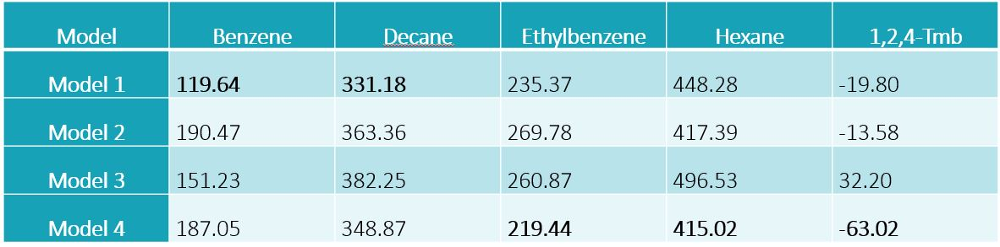
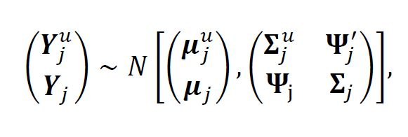

```{r setup, include=FALSE}
options(htmltools.dir.version = FALSE)
knitr::opts_chunk$set(collapse = TRUE,
                      fig.retina = 3)
library(xaringanExtra)
library(tidyverse)
library(gganimate)
library(leaflet)
library(sp)
library(raster)
library(tidyverse)
library(viridis)

rasters_path <- "rasters"

```

```{r xaringan-panelset, echo=FALSE}
xaringanExtra::use_panelset()
 # xaringanExtra::use_progress_bar(color = "#a6b155", location = "bottom")
```


class: title-slide, center, bottom
background-image: url("img/citytrees.jpg")
background-position: 50% 8%
background-size: 50%
background-color: #ffffff

# `r rmarkdown::metadata$title`

### `r rmarkdown::metadata$author` 

### `r rmarkdown::metadata$date`

---

class: center, montreal-slide, inverse


> Extra Material: Spatial modelling of ambient concentrations of VOCs in  Montreal, Canada

.footnote[Photo by Myriah Haggard]

---


# Inference procedure

- Under the Bayesian paradigm, model specification is complete after assigning a prior distribution to the parameter vector. 

--
- In models 1 and 2, $\boldsymbol{\alpha}$ and $\boldsymbol{\beta}$ follow a normal distribution with zero mean and large variance.

--
- For models 3 and 4 $\boldsymbol{\beta}_j \sim \mathcal{N}(\gamma, \psi^2)$ where $\gamma \sim \mathcal{N}(0, 10)$ and $\psi^2 \sim InvGamma(2, 1)$

--


- In models 1 and 3 $\sigma^2$  and $\tau^2$ follow an inverse gamma prior with mean fixed at 1 and an infinite variance.

--

-  For the spatial range $\phi_j$ we assigned an exponential prior with mean equal to the practical range.

---

# Inference procedure

- For all fitted models, the resultant posterior distribution does not have a closed form.

- Inference was performed using Markov Chain Monte Carlo methods to obtain samples from the posterior distribution implemented in Nimble.

---

# Model comparison

We chose the best model based on WAIC.

```{r echo=FALSE, out.width="100%"}

```


---


# Spatial interpolation

We want to predict the VOCs concentration at unobserved locations $\boldsymbol{Y^u_{j}}$, using the information from the observed locations $\boldsymbol{Y_{j}}$. 

The joint distribution of $\boldsymbol{Y^u_{j}}$ and $\boldsymbol{Y_{j}}$, is given by,

.center[
```{r echo=FALSE, out.width="50%"}

```
]
where $\boldsymbol{\mu_j^u}$ and $\boldsymbol{\mu_j}$ are the means of the unobserved and observed sites respectively; $\boldsymbol{\Sigma_j^u}$ is the covariance matrix among unobserved sites, and $\boldsymbol{\Psi_j}$ is the covariance matrix between observed and unobserved sites.

---

# Spatial interpolation

From the properties of the partition of the multivariate normal distribution, we can sample from,

$$(\boldsymbol{Y^u_{j}} |\boldsymbol{Y_{j}}, \boldsymbol{\theta}) \sim N(\mu^u_j + \boldsymbol{\Psi} \boldsymbol{\Sigma}_j^{-1}(\boldsymbol{Y}_j - \mu); \boldsymbol{\Sigma}^u_j - \boldsymbol{\Psi}'\boldsymbol{\Sigma}_j^{-1}\boldsymbol{\Psi})).$$
where $\boldsymbol{\theta}$ is the corresponding parameter vector for each model.

--

For models 2 and 4 where there is no spatial component, this distribution is reduced to

$$(\boldsymbol{Y^u_{j}} |\boldsymbol{Y_{j}}, \boldsymbol{\theta}) \sim N(\boldsymbol{\mu}_j^u, \boldsymbol{\Sigma}_j^u).$$
 where $\boldsymbol{\Sigma}_j^u$ is a diagonal matrix.

---

class: middle, center


# Benzene and Decane

.pull-left[

```{r load data, echo = FALSE}

dec_benzene <- raster( file.path(rasters_path,"benzene_mean_december_250m.tif")) %>%
  projectRaster( crs = "+proj=longlat +datum=WGS84")

apr_benzene <- raster( file.path(rasters_path,"benzene_mean_april_250m.tif")) %>%
  projectRaster( crs = "+proj=longlat +datum=WGS84")

aug_benzene <- raster(
  file.path(rasters_path,"benzene_mean_august_250m.tif")) %>%
  projectRaster( crs = "+proj=longlat +datum=WGS84")

pal <- colorNumeric("viridis", rbind(values(dec_benzene), values(apr_benzene), values(aug_benzene)), na.color = "transparent")

```

```{r plot benzene, warning=FALSE, echo=FALSE, fig.align="center"}

leaflet(height=500,width=550) %>% # Base group: OpenStreetMap map tiles
  addTiles() %>%
   setView(lng = -73.66, lat = 45.52, zoom = 10) %>% 
  # Overlay groups
    addRasterImage(dec_benzene, colors = pal, opacity = 0.8, project = FALSE, group ="December") %>%
  addRasterImage(apr_benzene, colors = pal, opacity = 0.8, project = FALSE, group =  "April") %>%
  addRasterImage(aug_benzene, colors = pal, opacity = 0.8, project = FALSE, group =  "August") %>%
  # Layers control
  addLayersControl(
    overlayGroups = c("December", "April", "August"),
    options = layersControlOptions(collapsed = TRUE)
  )%>%
  addLegend(pal = pal, values = rbind(values(dec_benzene), values(apr_benzene), values(aug_benzene)),
            title = "Benzene concentration log") %>% hideGroup(c("April", "August"))


```

]

.pull-right[

```{r load decane, echo = FALSE}

dec_decane <- raster(
  file.path(rasters_path,"decane_mean_december_250m.tif")) %>%
  projectRaster( crs = "+proj=longlat +datum=WGS84")

apr_decane <- raster(
  file.path(rasters_path, "decane_mean_april_250m.tif")) %>%
  projectRaster( crs = "+proj=longlat +datum=WGS84")

aug_decane <- raster(
  file.path(rasters_path,"decane_mean_august_250m.tif")) %>%
  projectRaster( crs = "+proj=longlat +datum=WGS84")

pal <- colorNumeric("viridis", rbind(values(dec_decane), values(apr_decane), values(aug_decane)), na.color = "transparent")
```

```{r plot decane, warning=FALSE, echo=FALSE, fig.align="center"}

 leaflet(height=500,width=550) %>% # Base group: OpenStreetMap map tiles
  addTiles() %>%
   setView(lng = -73.66, lat = 45.52, zoom = 10) %>% 
  # Overlay groups
    addRasterImage(dec_decane, colors = pal, opacity = 0.8, project = FALSE, group ="December") %>%
  addRasterImage(apr_decane, colors = pal, opacity = 0.8, project = FALSE, group =  "April") %>%
  addRasterImage(aug_decane, colors = pal, opacity = 0.8, project = FALSE, group =  "August") %>%
  # Layers control
  addLayersControl(
    overlayGroups = c("December", "April", "August"),
    options = layersControlOptions(collapsed = TRUE)
  )%>%
  addLegend(pal = pal, values = rbind(values(dec_decane), values(apr_decane), values(aug_decane)),
            title = "n-decane concentration log") %>% hideGroup(c("April", "August")) %>% hideGroup(c("April", "August"))

```

]

---

class: middle, center


# Ethylbenzene and Hexane

.pull-left[
```{r load ethyl, echo = FALSE}

dec_ethyl <- raster(
  file.path(rasters_path,"ethyl_mean_december_250m.tif")) %>%
  projectRaster( crs = "+proj=longlat +datum=WGS84")

apr_ethyl <- raster(
  file.path(rasters_path,"ethyl_mean_april_250m.tif")) %>%
  projectRaster( crs = "+proj=longlat +datum=WGS84")

aug_ethyl <- raster(
  file.path(rasters_path,"ethyl_mean_august_250m.tif")) %>%
  projectRaster( crs = "+proj=longlat +datum=WGS84")

pal <- colorNumeric("viridis", rbind(values(dec_ethyl), values(apr_ethyl), values(aug_ethyl)), na.color = "transparent")
```

```{r plot ethyl, warning=FALSE, echo=FALSE, fig.align="center"}

 leaflet(height=500,width=550) %>% # Base group: OpenStreetMap map tiles
  addTiles() %>%
   setView(lng = -73.66, lat = 45.52, zoom = 10) %>% 
  # Overlay groups
    addRasterImage(dec_ethyl, colors = pal, opacity = 0.8, project = FALSE, group ="December") %>%
  addRasterImage(apr_ethyl, colors = pal, opacity = 0.8, project = FALSE, group =  "April") %>%
  addRasterImage(aug_ethyl, colors = pal, opacity = 0.8, project = FALSE, group =  "August") %>%
  # Layers control
  addLayersControl(
    overlayGroups = c("December", "April", "August"),
    options = layersControlOptions(collapsed = TRUE)
  )%>%
  addLegend(pal = pal, values = rbind(values(dec_ethyl), values(apr_ethyl), values(aug_ethyl)),
            title = "Ethylbenzene concentration log") %>% hideGroup(c("April", "August"))


```

]

.pull-right[
```{r load hexane, echo = FALSE}

dec_hexane <- raster(
  file.path(rasters_path,"hexane_mean_december_250m.tif")) %>%
  projectRaster( crs = "+proj=longlat +datum=WGS84")

apr_hexane <- raster(
  file.path(rasters_path,"hexane_mean_april_250m.tif")) %>%
  projectRaster( crs = "+proj=longlat +datum=WGS84")

aug_hexane <- raster(
  file.path(rasters_path,"hexane_mean_august_250m.tif")) %>%
  projectRaster( crs = "+proj=longlat +datum=WGS84")

pal <- colorNumeric("viridis", rbind(values(dec_hexane), values(apr_hexane), values(aug_hexane)), na.color = "transparent")
```

```{r plot hexane, warning=FALSE, echo=FALSE, fig.align="center"}

 leaflet(height=500,width=550) %>% # Base group: OpenStreetMap map tiles
  addTiles() %>%
   setView(lng = -73.66, lat = 45.52, zoom = 10) %>% 
  # Overlay groups
    addRasterImage(dec_hexane, colors = pal, opacity = 0.8, project = FALSE, group ="December") %>%
  addRasterImage(apr_hexane, colors = pal, opacity = 0.8, project = FALSE, group =  "April") %>%
  addRasterImage(aug_hexane, colors = pal, opacity = 0.8, project = FALSE, group =  "August") %>%
  # Layers control
  addLayersControl(
    overlayGroups = c("December", "April", "August"),
    options = layersControlOptions(collapsed = TRUE)
  )%>%
  addLegend(pal = pal, values = rbind(values(dec_hexane), values(apr_hexane), values(aug_hexane)),
            title = "Hexane concentration log") %>% hideGroup(c("April", "August"))  %>% hideGroup(c("April", "August"))

```

]

---

background-image: url("img/uncertainty.png")
background-position: middle
background-size: 60%

# Uncertainty

---

background-image: url("img/fitted_vocs1.jpg")
background-position: middle
background-size: 50%

# Fitted values

---

background-image: url("img/fitted_vocs2.jpg")
background-position: middle
background-size: 50%

# Fitted values

---


background-image: url("img/fitted_vocs3.jpg")
background-position: middle
background-size: 50%

# Fitted values

---

class: center, toronto-slide, inverse

> Spatio-temporal modelling of pollen concentration in Toronto, Canada 

---

class: title-slide, left, middle, inverse

background-image: url("img/trees.jpg")
background-position: right
background-size: contain


.pull-left[

#  Manuscript 2


]

---
# Proposed model


.panelset[
.panel[.panel-name[Model 1]

$$\huge \rho_t = \rho$$
]

.panel[.panel-name[Model 2]

$$\huge logit(\rho_t) = \gamma_0 + \gamma_1 t + \gamma_2 t^2$$
]


.panel[.panel-name[Model 3]

$$\huge logit(\rho_t) = \gamma_t \qquad \text{ where } \rho_t \sim N(\gamma_{t-1}, W^2_2)$$
Best model for grass and tree pollen
]


.panel[.panel-name[Model 4]

$$\huge logit(\rho_t) = \boldsymbol{\gamma}\boldsymbol{z}_t$$
Best model for weed and total pollen
]
]

---

background-image: url("img/Figure3.png")
background-position: middle
background-size: 70%

# Coefficient estimates

---


background-image: url("img/Figure4.png")
background-position: middle
background-size: 50%

# Coefficient estimates

---

class: title-slide, left, middle, inverse

background-image: url("img/forest.jpg")
background-position: right
background-size: contain


.pull-left[

#  Manuscript 3


]

---

background-image: url("img/likelihood.png")
background-position: middle
background-size: 80%

# Inference procedure

---

background-image: url("img/model_comparison.png")
background-position: middle
background-size: 80%

# Model comparison

---

background-image: url("img/inference.png")
background-position: middle
background-size: 80%

# Prediction

---

background-image: url("img/simM1.png")
background-position: middle
background-size: 80%

# Simulations


